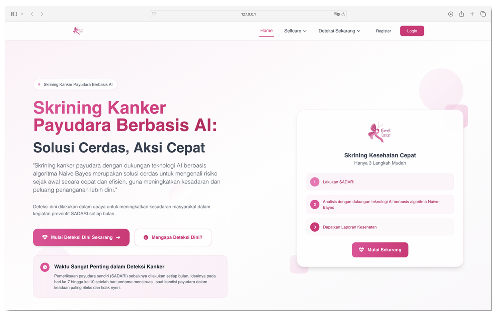
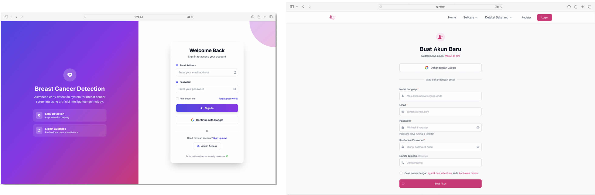
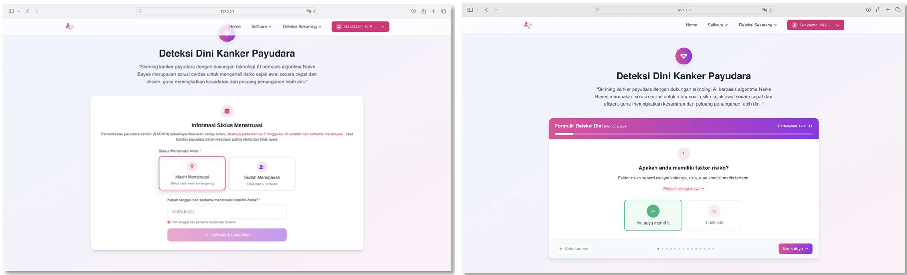
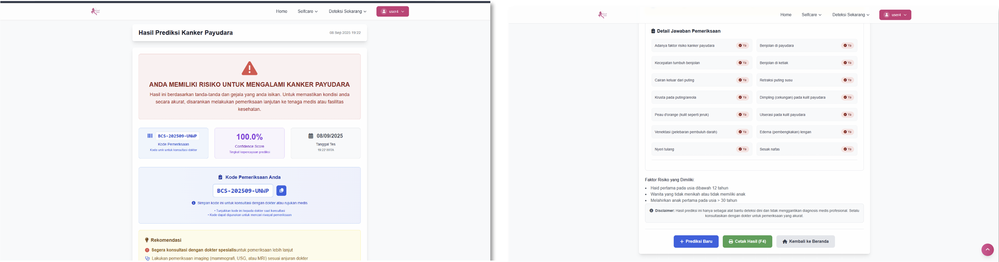
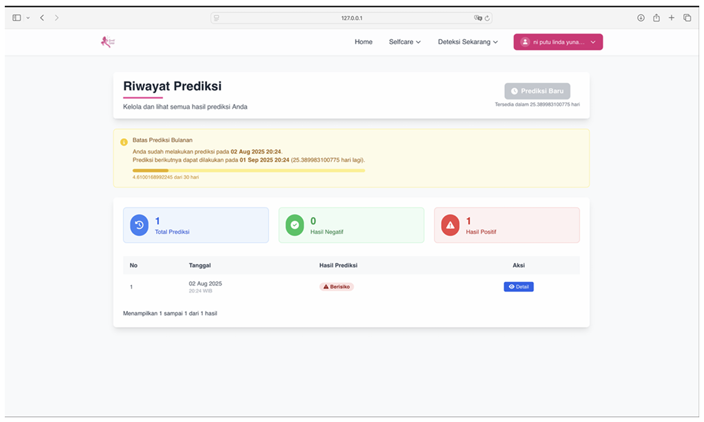
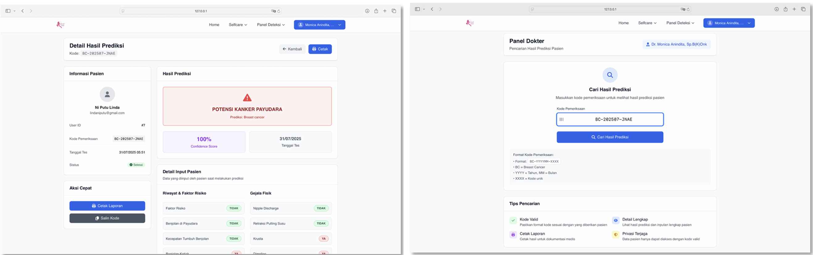

# 🎗️ Breast Cancer Screening Information System
### RSUP Prof. Dr. I.G.N.G Ngoerah, Bali


> A web-based breast cancer screening system designed specifically for RSUP Prof. Dr. I.G.N.G Ngoerah, Bali. Both the general public and medical staff can perform early digital detection of breast cancer risk by inputting experienced symptoms — the system predicts cancer indication using the Naïve Bayes algorithm.

> **⚠️ Collaborative Project**
> System development (Laravel + Spring Boot) was carried out by [@prayoga01](https://github.com/prayoga01).
> Dataset collection and cleaning were done together with a partner.
> Spring Boot API Repo: [breast-cancer](https://github.com/prayoga01/breast-cancer)

---

## 📋 Background

Breast cancer is the most prevalent disease in Indonesia and ranked 3rd highest at RSUP Ngoerah in 2024. National screening coverage has only reached **14.52%**, with Bali among the **6 lowest provinces** in Indonesia.

Key problems behind this project:
- Extremely low screening coverage both nationally and in Bali
- Electronic medical record data has not been utilized for clinical decision-making
- No digital screening system exists — education is still delivered manually through lectures and BSE (Breast Self-Examination) demonstrations

---

## 🏗️ System Architecture

```
┌─────────────────────┐         ┌──────────────────────┐
│   Laravel (Web App) │ ──API──▶│  Spring Boot (API)   │
│   Frontend + Logic  │◀──JSON──│  Naïve Bayes Model   │
└─────────────────────┘         └──────────────────────┘
         │                                │
         ▼                                ▼
    MySQL Database                  WEKA Dataset
   (users, profiles,             (225 medical records
   prediction, etc.)              from RSUP Ngoerah)
```

- **Laravel** → Web application (UI, authentication, data management)
- **Spring Boot** → REST API for prediction using the Naïve Bayes model
- **WEKA** → Data mining tool for training the model from medical record datasets

---

## 📸 Screenshots

**Landing Page**

The first page encountered by users when accessing the system. It is designed to be informative and responsive in order to raise public awareness about the importance of independent breast cancer screening. This page can be accessed without logging in and contains the main navigation to Selfcare, Start Screening, Register, and Login. It also provides a call-to-action button, “Start Self-Detection Now,” which directly directs users to begin the screening process.


**Login & Register Page**

The system provides three separate authentication pathways based on user roles: Public Users, Doctors, and Administrators. Public users can register independently through the registration form or use a Google account to accelerate the process. Doctors and administrators use credentials that have been prepared by the system administrator. The system implements role-based access control (RBAC) to ensure that each user can only access features according to their assigned role.


**Symptom Input Form**

In this screening process, before filling out the form, users are asked to select their menstrual cycle status (still menstruating or already menopausal) — an important hormonal validation for determining the appropriate timing of Breast Self-Examination (BSE/SADARI). Users then answer 14 questions one by one regarding the conditions they experience, such as the presence of lumps, nipple discharge, skin changes, and metastatic symptoms. Each question is equipped with a “Learn More” button that opens a popup modal containing illustrations and medical explanations, ensuring that users fully understand the condition being referred to before answering. Before the results are displayed, the system presents a confirmation alert to ensure that all responses are correct.


**Prediction Result Page**

This page displays the real-time output of the Naïve Bayes model based on the 14 symptom inputs provided by the user. The results include the risk classification (Breast Cancer or Non-Breast Cancer), confidence score (prediction confidence level), examination date, and a recap of all user responses. In addition, the page displays a unique Examination Code (alphanumeric format) that can be provided to doctors for professional access to the screening results. The page also provides follow-up recommendations and a “Print Results” button, allowing users to save or print the results as a document.

**Prediction History**

Users can view the complete history of all screening activities they have previously performed. This page displays information such as the date of the most recent prediction, the next eligible prediction date, the total number of predictions, the number of negative results, and the number of positive results. Users can also click the “Detail” button to review the signs and symptoms entered during a specific prediction period.


**Doctor Panel — Patient Result Search & Detail)**

An exclusive feature for doctor users. After logging in, doctors can access the Doctor Panel and enter the Examination Code provided directly by the patient. This code is unique for each prediction result and functions as a privacy key — only the patient has the authority to decide who may access their results. Once a valid code is entered, doctors can view the Prediction Result Detail page, which contains the patient’s personal information, Naïve Bayes prediction result, confidence score, examination date, and a complete recap of all signs and symptoms entered by the patient. Doctors can also print the report or save the code for future consultation references.

---

## ✨ Features

### General User / Patient
- 🔐 Registration & Login
- 📝 Symptom Input Form (with menstrual cycle / menopause validation)
- 🤖 Cancer Risk Prediction (Naïve Bayes)
- 🔑 Examination Code — unique alphanumeric code generated after screening, to share with a doctor
- 🖨️ Print Screening Result
- 📊 Prediction History
- 📚 Selfcare / BSE Education
- 👤 Profile Management

### Doctor
- 🔐 Login — using registered email & password
- 👤 Profile Management (must be completed before accessing panel)
- 🩺 Doctor Panel — enter examination code (received from patient) to access their screening result
- 📋 View Patient Screening Result Detail

### Admin
- 📋 Dashboard
- 🗂️ All Patient Prediction History
- 👨‍⚕️ Manage Doctors
- 👥 Manage Users
---

## 🤖 Prediction Model

| Item | Detail |
|------|--------|
| Algorithm | Naïve Bayes |
| Dataset | 225 electronic medical records from RSUP Ngoerah (Breast Cancer & non-Breast Cancer) |
| Tools | WEKA (pre-processing & training) |
| Validation Split | 80% training / 20% testing |
| Accuracy | **89.90%** |
| Precision | **80%** |
| Recall | **85.70%** |

**Attributes / variables used:**
Risk factors, breast lump, mass growth rate, nipple discharge, nipple retraction, crust, dimpling, peau d'orange, ulceration, venectasia, armpit lump, arm edema, bone pain, shortness of breath

---

## 🛠️ Tech Stack

| Category | Technology |
|----------|------------|
| Web Framework | PHP, Laravel |
| API Server | Spring Boot (Java) |
| Frontend | Bootstrap, Blade Template |
| Database | MySQL |
| Dev Environment | XAMPP |
| Data Mining | WEKA |
| Development Method | Agile Scrum |

---

## ⚙️ Installation & Setup

### Prerequisites
- PHP >= 8.0
- Composer
- MySQL
- XAMPP
- Node.js & NPM
- Spring Boot API running → [breast-cancer](https://github.com/prayoga01/breast-cancer)

### Steps

```bash
# 1. Clone the repository
git clone https://github.com/prayoga01/Breast-Cancer-app.git
cd Breast-Cancer-app

# 2. Install PHP dependencies
composer install

# 3. Install frontend dependencies
npm install && npm run dev

# 4. Copy the environment file
cp .env.example .env

# 5. Generate app key
php artisan key:generate

# 6. Configure database & API in .env
DB_DATABASE=your_database_name
DB_USERNAME=your_username
DB_PASSWORD=your_password

GOOGLE_CLIENT_ID=your_google_client_id
GOOGLE_CLIENT_SECRET=your_google_client_secret

# Spring Boot API URL
NAIVEBAYES_API_URL=http://localhost:8080

# 7. Run migrations & seeders
php artisan migrate --seed

# 8. Start the development server
php artisan serve
```

Access the app at `http://localhost:8000`

> **⚠️ Make sure the Spring Boot API is running** at `http://localhost:8080` before using the prediction feature.

---

## 📁 Main Directory Structure

```
Breast-Cancer-app/
├── app/
│   ├── Http/Controllers/
│   └── Models/
├── database/
│   ├── migrations/
│   └── seeders/
├── public/
├── resources/
│   └── views/
│       ├── auth/
│       ├── admin/
│       └── user/
├── routes/
│   └── web.php
└── .env.example
```

---

## 🗄️ Database Structure

| Table | Description |
|-------|-------------|
| `users` | User account data |
| `profiles` | User profile data |
| `contents` | Education / selfcare content |
| `prediction` | Symptom input data for prediction |
| `prediction_result` | Prediction results from the model |
| `doctors` | Doctor data |

---

## 👨‍💻 Developer

**Yoga Pratama** — Fullstack Developer (Laravel + Spring Boot)
- GitHub: [@prayoga01](https://github.com/prayoga01)

**Partner** — Dataset Collection & Data Cleaning
- GitHub: [@lindayuna](https://github.com/lindayuna)

---

## 📝 License

This project was created for research purposes and for the development of a screening system.
